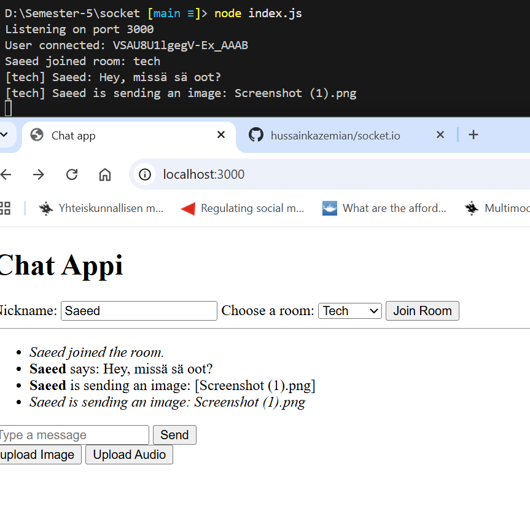

# Socket.IO Namespaces and Rooms

## Analogy

```
Namespace = Building
Room = Room inside the building
Socket = Person who can enter multiple rooms but only in one building
```

## Namespaces

```
* A namespace in Socket.IO is essentially a separate communication channel under the same connection/same server.
* By default, all sockets connect to the default namespace '/'.
* Custom namespaces such as /chat, /admin, /support, etc. can be created.
* Each namespace has its own event handler and middleware.
```

## Example

```javascript
// Server: create a /chat namespace
const chatNamespace = io.of('/chat');

chatNamespace.on('connection', (socket) => {
  console.log('User connected to chat namespace:', socket.id);
});
```

```javascript
// Client: connect to /chat namespace
const socket = io('/chat');
```

## Rooms

```
* A room is a subgroup inside a namespace.
* Rooms are dynamic, they are created when the first user joins, and removed when empty.
* A user can join multiple rooms in the same namespace.
* Rooms are mainly used for scoping messages (only send to people in a specific room).
```

## Example

```javascript
// Server: user joins a room inside the /chat namespace
chatNamespace.on('connection', (socket) => {
  socket.on('join room', (room) => {
    socket.join(room);
    console.log(`User ${socket.id} joined room: ${room}`);
  });
});
```

```javascript
// Client: join a room inside the namespace
socket.emit('join room', 'general');
```

## A user created and join to a room


## User can upload image and audio



